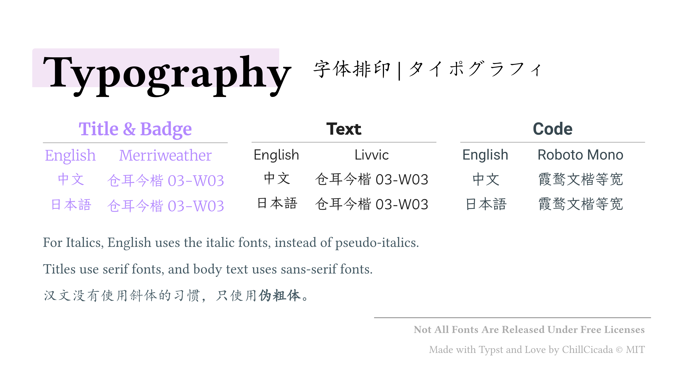
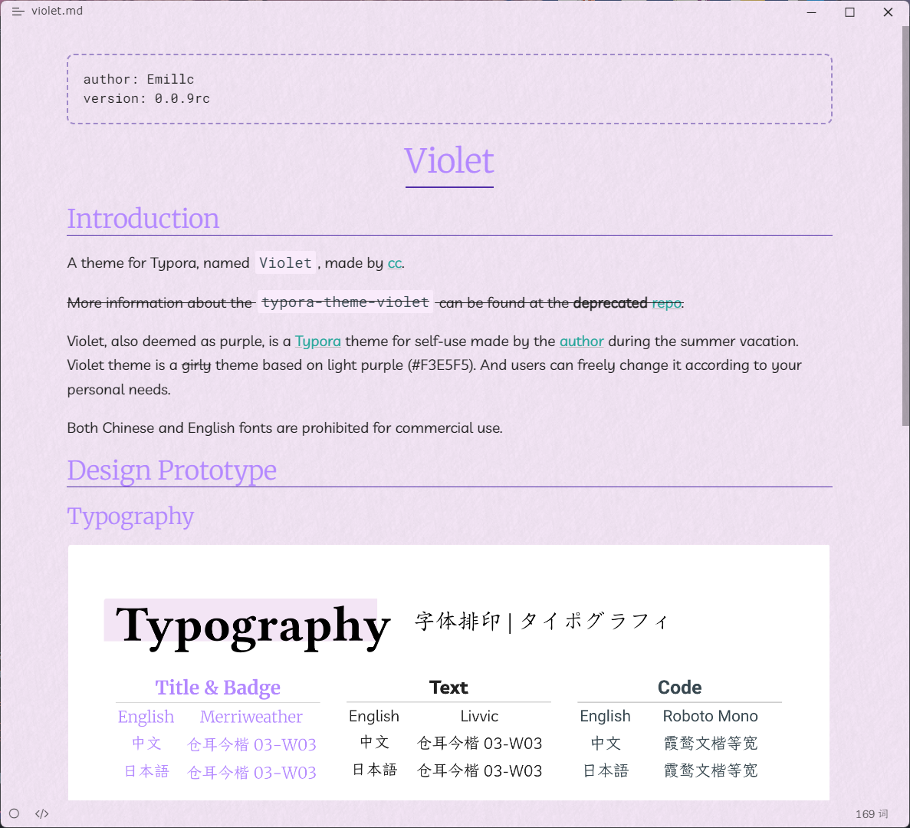

# Violet

## Introduction

A theme for Typora, named `Violet`, made by [cc](https://github.com/chillcicada).

~~More information about the `typora-theme-violet` can be found at the **deprecated** [repo](https://github.com/chillcicada/typora-theme-violet).~~

Violet, also deemed as purple, is a [Typora](https://typora.io/) theme for self-use made by the [author](https://github.com/chillcicada) during the summer vacation. Violet theme is a ~~girly~~ theme based on light purple (#F3E5F5). And users can freely change it according to your personal needs.

Both Chinese and English fonts are prohibited for commercial use.

## Design Prototype

### Typography

### Color Scheme

TODO

## Snapshot

## Acknowledgment

Without these following projects there would not be Violet.

Thanks for:

- [typora-vue-theme](https://github.com/blinkfox/typora-vue-theme)
- [typora-purple-theme](https://github.com/hliu202/typora-purple-theme)
- [Material Design Colors](https://materialui.co/colors/)
- Every User

## Feedback

If you have any problem or meet some troubles when using Violet, it's better for you to send an issue to me at [here](https://github.com/chillcicada/typora-violets/issues). Well, you can also commit your own debug code and even pull request to me.

Just enjoy it!
